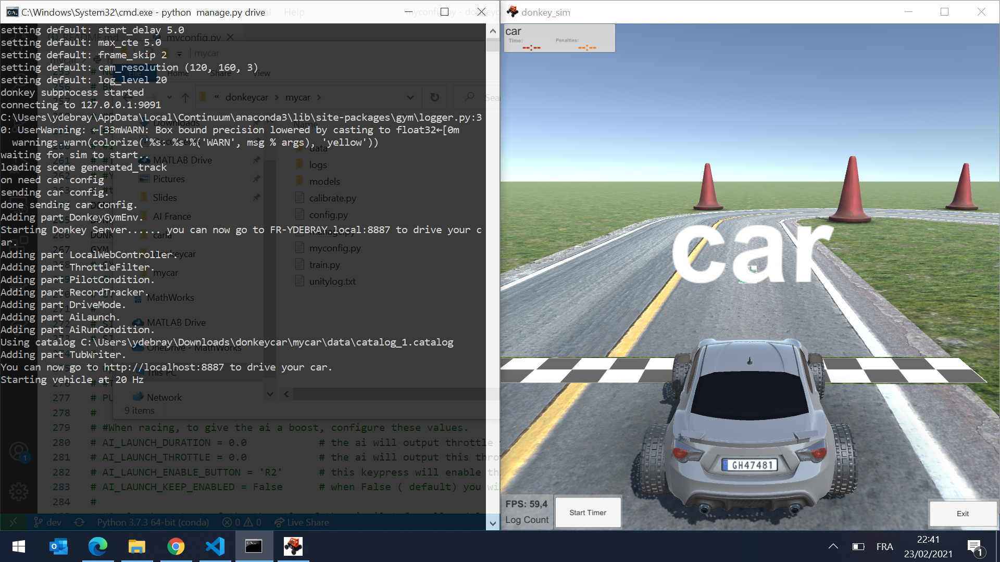
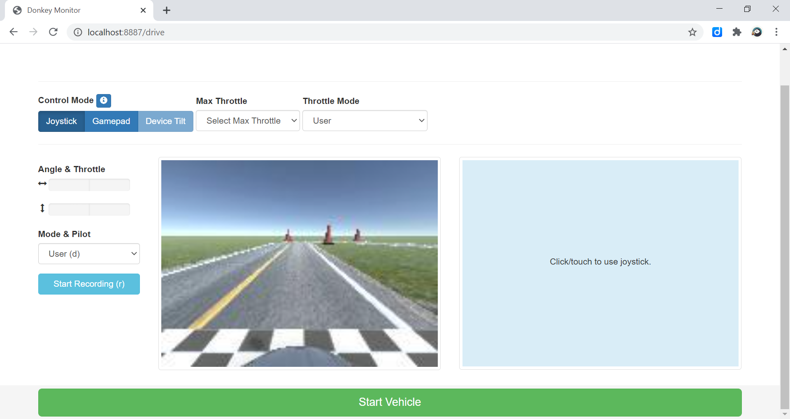

# Donkeycar


```
________             ______                   _________
___  __ \_______________  /___________  __    __  ____/_____ ________
__  / / /  __ \_  __ \_  //_/  _ \_  / / /    _  /    _  __ `/_  ___/
_  /_/ // /_/ /  / / /  ,<  /  __/  /_/ /     / /___  / /_/ /_  /
/_____/ \____//_/ /_//_/|_| \___/_\__, /      \____/  \__,_/ /_/
                                 /____/

using donkey v4.2.0 ...
Creating car folder: mysim
making dir  mysim
Creating data & model folders.
making dir  mysim\models
making dir  mysim\data
making dir  mysim\logs
Copying car application template: complete
Copying car config defaults. Adjust these before starting your car.
Copying train script. Adjust these before starting your car.
Copying calibrate script. Adjust these before starting your car.
Copying my car config overrides
Donkey setup complete.
```
[Getting started with Donkey Sim](https://www.youtube.com/watch?v=wqQMmHVT8qw)

## Step 1: Install Donkey Simulator

[Donkey Gym Release](https://github.com/tawnkramer/gym-donkeycar/releases)

## Step 2: Install Donkey software

https://docs.donkeycar.com/guide/install_software/

```
git clone https://github.com/autorope/donkeycar
cd donkeycar
pip install -e .[pc]
```

## Step 3: Create car 


```
git clone https://github.com/autorope/donkeycar
cd donkeycar
pip install -e .[pc]
cd ..
donkey createcar --path mycar
```

## Step 4: Config car

modify [car/myconfig.py](car/myconfig.py):
```python
DONKEY_GYM = True
DONKEY_SIM_PATH = "Path\\to\\DonkeySimWin\\donkey_sim.exe" #"/home/tkramer/projects/sdsandbox/sdsim/build/DonkeySimLinux/donkey_sim.x86_64" when racing on virtual-race-league use "remote", or user "remote" when you want to start the sim manually first.
DONKEY_GYM_ENV_NAME = "donkey-generated-track-v0" # ("donkey-generated-track-v0"|"donkey-generated-roads-v0"|"donkey-warehouse-v0"|"donkey-avc-sparkfun-v0")
GYM_CONF = { "body_style" : "car01", "body_rgb" : (128, 128, 128), "car_name" : "car", "font_size" : 100} # body style(donkey|bare|car01) body rgb 0-255
```


## Step 5: Drive
```
python manage.py drive
```



http://localhost:8887/drive

